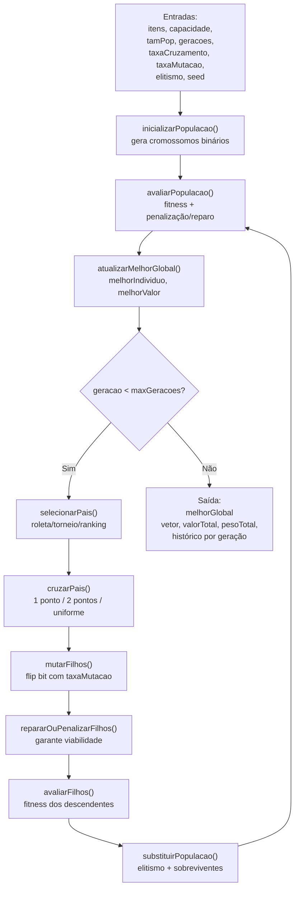
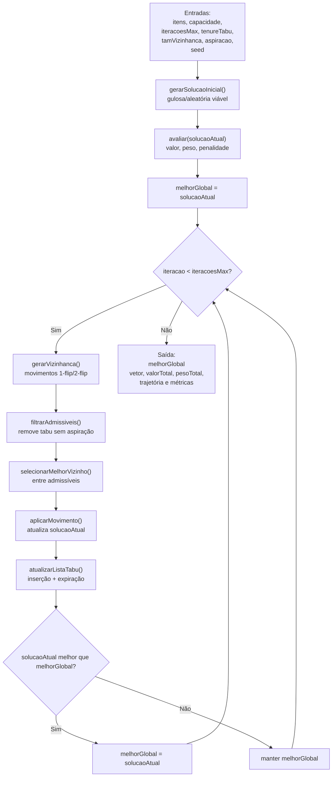
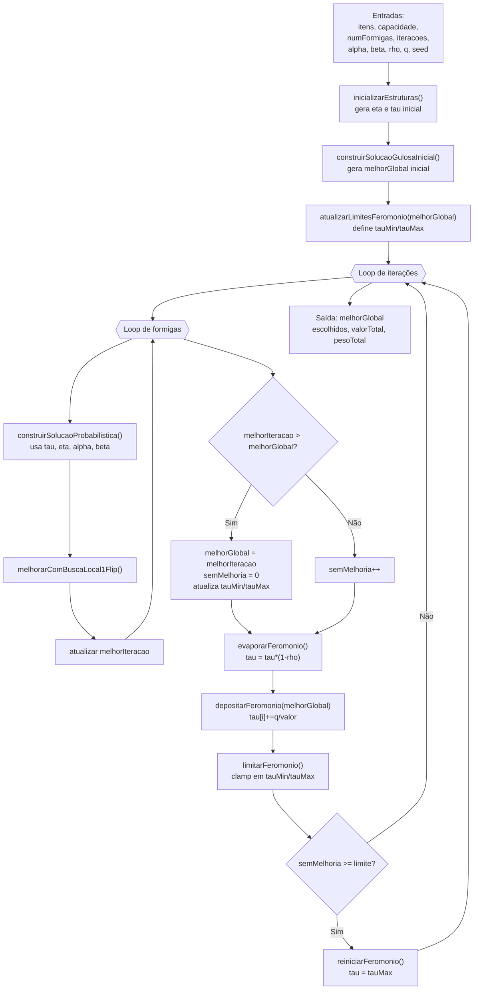

# Diagramas de Fluxo de Dados (DFD) — GA, Busca Tabu e ACO para Mochila 0/1

Este documento detalha o fluxo de dados das três meta-heurísticas usadas no problema da mochila 0/1, com ênfase nas estruturas de estado e nos ciclos internos de cada algoritmo.

---

## 1) DFD — Algoritmo Genético (GA)

Este diagrama resume o fluxo de dados principal de uma implementação típica de GA para mochila 0/1.

### Dicionário rápido de dados (GA)
- `populacao`: conjunto de cromossomos da geração corrente.
- `fitness[i]`: aptidão do indivíduo `i` após penalização/reparo.
- `melhorGlobal`: melhor indivíduo em toda a execução.
- `geracao`: contador do ciclo evolutivo.

---

## 2) DFD — Busca Tabu (Tabu Search)

Este diagrama resume o fluxo de dados principal de uma implementação de Busca Tabu para mochila 0/1.

### Dicionário rápido de dados (Tabu)
- `solucaoAtual`: solução no ponto corrente da busca.
- `listaTabu`: memória de curto prazo com movimentos proibidos e validade.
- `melhorGlobal`: melhor solução observada durante toda a execução.
- `iteracao`: contador principal da busca.

---

## 3) DFD — Ant Colony Optimization (ACO)

Este diagrama resume o fluxo de dados principal do `AcoCore` para mochila 0/1.

### Dicionário rápido de dados (ACO)
- `tau[i]`: nível de feromônio por item (memória coletiva).
- `eta[i]`: heurística local por item (ex.: valor/peso normalizado).
- `melhorIteracao`: melhor solução encontrada na iteração atual.
- `melhorGlobal`: melhor solução encontrada em toda a execução.
- `semMelhoria`: contador de estagnação para reinicialização de feromônio.

---

## Observações
- Os três fluxos podem usar penalização, reparo ou ambos para tratar inviabilidade de capacidade.
- Para reprodutibilidade experimental, registre `seed`, tempo de execução e configuração completa dos hiperparâmetros.
- Os nomes de função no diagrama são descritivos e podem ser mapeados para os métodos concretos da implementação.
