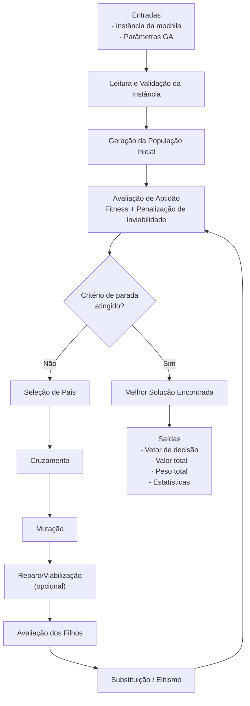
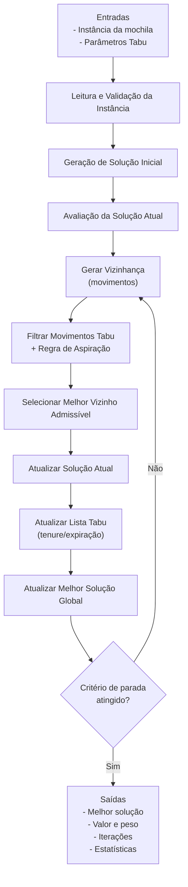
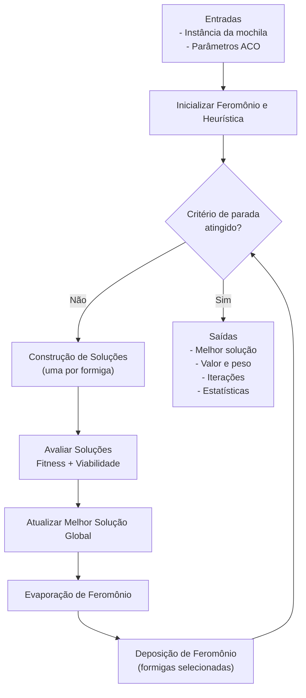

# Diagramas de Fluxo de Dados — GA, Busca Tabu e ACO

Este documento descreve o fluxo de dados para três meta-heurísticas aplicadas ao problema da mochila: **Algoritmo Genético (GA)**, **Busca Tabu (Tabu Search)** e **Ant Colony Optimization (ACO)**.

---

## 1) Diagrama de Fluxo de Dados — Algoritmo Genético (GA)

### Fluxos de dados principais (GA)
- **Instância**: itens (valor, peso) e capacidade da mochila.
- **Parâmetros**: tamanho da população, taxa de cruzamento, taxa de mutação, número máximo de gerações, estratégia de seleção.
- **Estado evolutivo**: população atual, fitness por indivíduo, melhor indivíduo global, geração corrente.
- **Saídas**: melhor solução viável, histórico de evolução (opcional), tempo de execução.

---

## 2) Diagrama de Fluxo de Dados — Busca Tabu (Tabu Search)

### Fluxos de dados principais (Tabu)
- **Instância**: itens e capacidade da mochila.
- **Parâmetros**: tenure tabu, número máximo de iterações, tamanho da vizinhança, política de aspiração.
- **Memória de busca**: lista tabu (movimentos proibidos e validade), solução atual, melhor solução global.
- **Saídas**: melhor solução viável, trajetória da busca (opcional), métricas de convergência.

---

## 3) Diagrama de Fluxo de Dados — Ant Colony Optimization (ACO)

### Fluxos de dados principais (ACO)
- **Instância**: itens (valor, peso) e capacidade da mochila.
- **Parâmetros**: número de formigas, taxa de evaporação, influência de feromônio (`alpha`), influência heurística (`beta`) e máximo de iterações.
- **Memória de busca**: matriz/vetor de feromônio, melhor solução da iteração e melhor solução global.
- **Saídas**: melhor solução viável, histórico de convergência (opcional), tempo e métricas de execução.

---

## Observações
- Os três fluxos podem ser implementados com controle de inviabilidade por penalização ou reparo.
- Para experimentos reproduzíveis, recomenda-se registrar **seed aleatória**, tempo e configuração completa dos parâmetros.
